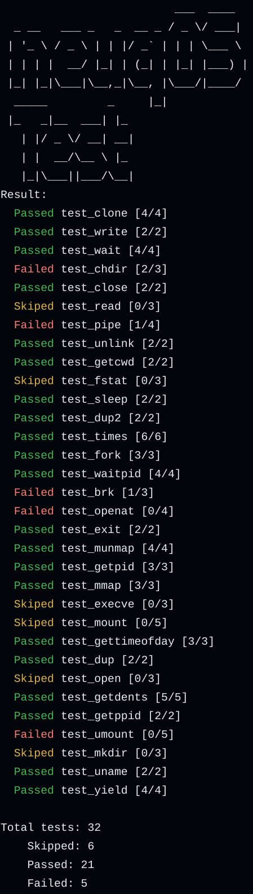

# neuqOS

A simple os kernel for riscv64

## Build Dependencies

- `riscv64-elf-gcc`
- `riscv64-elf-binutils`
- `cargo-binutils`
- `llvm-tools-preview`

For command line instructions, refer to `.github/workflows/ci.yml`

## Build

```shell
# or simply run `make`
make build
```

## Run

```shell
make run
```

## Test

#### 本地测试
在仓库根目录执行
```bash
make test
```

这将模拟比赛的评测环境，首先执行`make all`，然后使用要求的 Qemu 启动参数挂载测试样例并运行内核进行测试。运行结束后，测试脚本`test/visualize_result.py`将会生成测试结果的可视化报告。

下面是生成的可视化报告的一个例子：



对于每个测试，
- Skiped 表示测试未进行，或者该测试样例未输出结果就被内核杀死
- Failed 表示测试已经执行，且有输出，但是测试结果不符合预期
- Passed 表示测试通过，输出结果符合预期

其中，`[x/y]` 表示单个测试的结果，`x` 为测试通过的测试点数量，`y` 为该测试的测试点总数。

最后会给出测试的总体结果和得分。

#### 持续集成测试

对于`submit`分支下的每次提交（将来会合并到`main`分支），都会有一个 GitHub Actions workflow 自动运行测试。测试过程基本符合上述本地测试的流程，但是会在测试结束后将测试结果，Qemu输出和测试脚本对输出的判断结果都上传到 GitHub Actions 的 artifacts 中，以便查看详细的测试结果。同时，可视化脚本也会运行，无需下载 artifacts 即可查看测试结果。

注意，由于当前本仓库的内核仍然处于开发阶段，大量测试样例不能通过，因此测试脚本不会将 GitHub Actions 标记为失败，而是会将测试结果上传到 artifacts 中，以便查看详细的测试结果。如需查看测试结果，请手动查看每个 commit 的 GitHub Actions 的运行结果。

## Debug

### Command line

#### Launch QEMU instance with GDB server
```shell
make debug
```

#### Connect to GDB server
```shell
make connect
```

### VSCode
Open the repository in VSCode and press <kbd>F5</kbd> to start debugging.

## License

MIT
