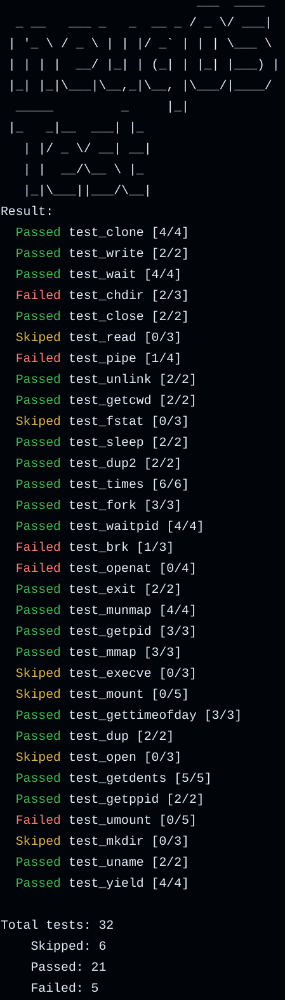

# neuqOS 技术文档


---

### [文档总目录](content.md)

---

## 仓库Actions

[](https://github.com/neuq-rcore/rCore/actions/workflows/ci.yml)

[](https://github.com/neuq-rcore/rCore/actions/workflows/mirror.yml)

[](https://github.com/neuq-rcore/rCore/actions/workflows/oj.yml)

## Environment and Language

 LLanguage： [`rust`](language.md)

 Build Dependencies

- `riscv64-elf-gcc`

- `riscv64-elf-binutils`

- `cargo-binutils`

- `llvm-tools-preview`

  For command line instructions, refer to `.github/workflows/ci.yml`

## Rreparation

### Build

```shell
# or simply run `make`
make build
```

### Run

```shell
make run
```

### Test

#### 本地测试
在仓库根目录执行
```bash
make test
```

运行 `make test` 结果



## 完成情况

| 内核模块 | 完成情况 | 系统调用 |
| :------- | -------- | -------- |
|          |          |          |
|          |          |          |
|          |          |          |
|          |          |          |

## 参赛队员

徐才益

薛丁豪

白聪

## 参考文档

- [rCore-Tutorial-Book 第三版]([rCore-Tutorial-Book-v3 3.6.0-alpha.1 文档 (rcore-os.cn)](https://rcore-os.cn/rCore-Tutorial-Book-v3/index.html))
- [从头写一个RISC-V OS--汪辰]([plctlab/riscv-operating-system-mooc: 《从头写一个RISC-V OS》课程配套的资源 (github.com)](https://github.com/plctlab/riscv-operating-system-mooc))
- [暑期rcore实验笔记]([xsp-daily-work/暑期rcore实验笔记 at master · xushanpu123/xsp-daily-work (github.com)](https://github.com/xushanpu123/xsp-daily-work/tree/master/暑期rcore实验笔记))

- [南京大学 计算机科学与技术系 计算机系统基础 课程实验]([Introduction · GitBook (nju-projectn.github.io)](https://nju-projectn.github.io/ics-pa-gitbook/ics2024/))
