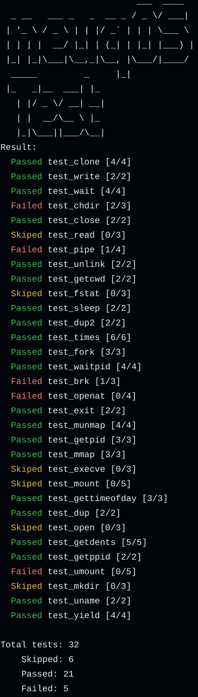

# neuqOS 技术文档

---

## 编译环境与工具链说明

编程语言： `rust`

工具链： [`rust-toolchain.toml`](../rust-toolchain.toml)

## 完成情况

| 内核模块| 完成情况 | 系统调用 |
| :------- | ---- | ---- |
|          |      |      |
|          |      |      |
|          |      |      |
|          |      |      |

运行 `make test` 结果

## 参赛队员

徐才益

薛丁豪

白聪

## 参考文档

- [1] [rCore-Tutorial-Book 第三版]([rCore-Tutorial-Book-v3 3.6.0-alpha.1 文档 (rcore-os.cn)](https://rcore-os.cn/rCore-Tutorial-Book-v3/index.html))
- [2] [从头写一个RISC-V OS--汪辰]([plctlab/riscv-operating-system-mooc: 《从头写一个RISC-V OS》课程配套的资源 (github.com)](https://github.com/plctlab/riscv-operating-system-mooc))
- [3] [暑期rcore实验笔记]([xsp-daily-work/暑期rcore实验笔记 at master · xushanpu123/xsp-daily-work (github.com)](https://github.com/xushanpu123/xsp-daily-work/tree/master/暑期rcore实验笔记))

- [4] [南京大学 计算机科学与技术系 计算机系统基础 课程实验]([Introduction · GitBook (nju-projectn.github.io)](https://nju-projectn.github.io/ics-pa-gitbook/ics2024/))
